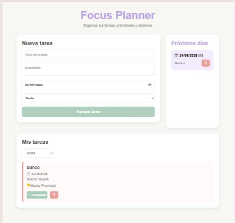
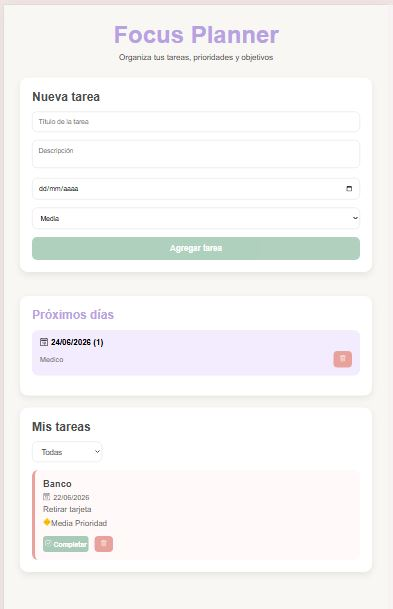

# Focus Planner

Aplicación web desarrollada con React para organizar tareas, gestionar prioridades y visualizar actividades pendientes de manera simple e intuitiva.

## Demo

[Probar Focus Planner](https://focus-planner-xi.vercel.app/)

## Funcionalidades

* Crear tareas con título, descripción, fecha y prioridad.
* Marcar tareas como completadas.
* Eliminar tareas con confirmación mediante SweetAlert2.
* Filtrar tareas por estado:
  * Todas
  * Completadas
  * Pendientes
* Visualizar tareas futuras agrupadas por fecha.
* Persistencia de datos mediante Local Storage.
* Diseño responsive para dispositivos móviles y tablets.
* Interfaz moderna con React Icons.

## Capturas

## Vista principal (1024px)



## Vista principal (768px)



## Tecnologías utilizadas

* React
* JavaScript
* CSS3
* React Icons
* SweetAlert2
* Local Storage
* Git y GitHub

## Instalación

Clonar el repositorio:

```bash
git clone https://github.com/stellamarisl/focus-planner.git
```

Ingresar al proyecto:

```bash
cd focus-planner
```

Instalar dependencias:

```bash
pnpm install
```

Ejecutar el proyecto:

```bash
pnpm run dev
```

## Autor

Desarrollado por Stella Maris Loreto como proyecto de práctica en React.
